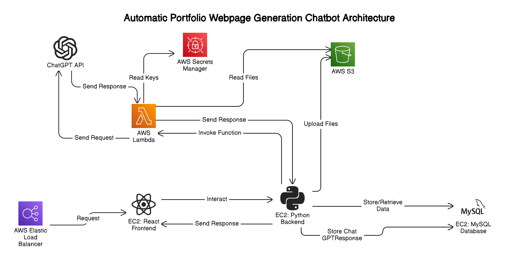

# Automated Portfolio Generation Chatbot

This project is an automated portfolio generation chatbot deployed on AWS. It transforms resumes into live portfolio websites using AWS services for processing, storage, and hosting. 

---

## Table of Contents
- [Project Overview](#project-overview)
- [Architecture](#architecture)
  - [System Design](#system-design)
  - [Component Breakdown](#component-breakdown)
  - [Architecture Diagram](#architecture-diagram)
- [Features](#features)
- [Technologies Used](#technologies-used)
- [Deployment](#deployment)
  - [Setup Instructions](#setup-instructions)
- [CI/CD Pipeline](#cicd-pipeline)
- [Usage](#usage)
  - [Uploading Resumes](#uploading-resumes)
  - [Generating Portfolios](#generating-portfolios)
- [References](#references)
- [Contributors](#contributors)

---

## Project Overview

This project provides an automated system to create personalized portfolio websites from user-uploaded resumes, complete with dynamic content that aligns with specific job descriptions. Users upload their resumes, and through serverless processing and automated deployment, the chatbot generates a live, personalized website hosted on AWS.

### Demo Video
A demo video explaining the setup and deployment process using AWS CloudFormation can be found [here](Demo.mp4). This video provides a walkthrough of the CloudFormation template and deployment process along with a live demo of the application.

---

## Architecture

### System Design

The architecture combines serverless and microservices design patterns, leveraging several AWS services to ensure scalability, cost-efficiency, and security.

1. **AWS Lambda**: Handles backend processing and logic, including parsing the resume and generating website content based on job descriptions.
2. **S3**: Stores user-uploaded resumes and hosts the generated portfolio website.
3. **API Gateway**: Provides a secure RESTful API for frontend and backend communication.
4. **RDS (Optional)**: If needed, to store user information and portfolio history.
5. **CloudWatch**: Monitors system performance, logging, and metrics for effective troubleshooting.

### Component Breakdown

- **Frontend**: Built with React, allowing users to upload their resumes, view generated portfolios, and interact with generated website links.
- **Backend**: Python-based AWS Lambda functions handle content generation, utilizing the OpenAI API for generating personalized portfolio sections based on resume content.
- **Storage**: S3 buckets are used to store both the resumes and the final HTML/CSS files for each portfolio, making them accessible via unique URLs.
- **CI/CD**: GitLab CI/CD automates build, test, and deploy pipelines, using Docker to ensure consistency across deployments.

### Architecture Diagram

*Figure 1*: Architecture Diagram for Automated Portfolio Generation chatbot

---

## Features

- **Resume Upload and Processing**: Users upload resumes, which are securely stored and processed for content extraction.
- **Dynamic Portfolio Generation**: Content is personalized based on specific job descriptions, creating a unique portfolio for each user.
- **Live Hosting**: Portfolios are deployed as live, accessible websites on AWS S3.
- **User Notifications**: Real-time notifications are sent upon portfolio completion.
- **Authentication and Authorization**: Secured endpoints using API Gateway and token-based authentication (JWT).
- **CI/CD Pipeline**: Automated build, test, and deployment using GitLab CI/CD.

---

## Technologies Used

- **Frontend**: React, TailwindCSS
- **Backend**: Python, AWS Lambda
- **Cloud Services**: AWS (S3, Lambda, RDS, API Gateway, CloudWatch)
- **CI/CD**: GitLab CI/CD, Docker
- **Third-Party API**: OpenAI API for content generation

---

## Deployment

### Setup Instructions

1. **AWS Setup**:
   - Create S3 buckets for storing resumes and hosting portfolio files.
   - Set up API Gateway for secure HTTP requests to Lambda functions.
   - Create Lambda functions for processing resumes, generating HTML, and deploying to S3.
   - Configure CloudWatch for logging and monitoring.

2. **Frontend**:
   - Install dependencies with `npm install`.
   - Configure API endpoints for API Gateway and S3.
   - Deploy frontend on AWS S3 or your preferred hosting service.

3. **CI/CD**:
   - Set up GitLab CI/CD pipeline with Docker support for consistent deployment.
   - Configure pipeline to build, test, and deploy both frontend and backend services.

### CI/CD Pipeline

The CI/CD pipeline in GitLab automates the entire deployment process:
- **Step 1**: Code is built and tested.
- **Step 2**: Docker containers are created for frontend and backend.
- **Step 3**: Docker images are deployed to AWS.
- **Step 4**: System is monitored in CloudWatch for errors and performance metrics.

---

## Usage

### Uploading Resumes

1. Visit the main website.
2. Sign in or create an account.
3. Upload your resume file (PDF or DOCX).
4. Submit a job description if you want the portfolio to be tailored to a specific role.

### Generating Portfolios

1. After uploading, the chatbot will process the resume.
2. You will receive a preview of generated chatbot in response.
3. You can give prompts to update the portfolio.
4. You can deploy your portfolio with a click of a button.
3. You can view and download the portfolio, which is hosted on S3 for easy sharing.

---

## References

1. **AWS Documentation**: [AWS Lambda](https://docs.aws.amazon.com/lambda/latest/dg/welcome.html), [S3](https://docs.aws.amazon.com/s3/index.html)
2. **GitLab CI/CD**: [GitLab CI/CD Documentation](https://docs.gitlab.com/ee/ci/)
3. **Docker**: [Docker Documentation](https://docs.docker.com/)

---

## Contributors

- Harsh Vaghasiya

